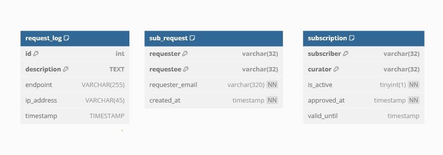

# Audibook SOAP Service

## Introduction

Audibook SOAP Service adalah salah satu service yang disediakan oleh layanan Audibook, yang dibangun dengan protokol SOAP. Aplikasi ini dibuat dengan menggunakan Java dengan library Jax-WS. Aplikasi ini dibuat untuk memenuhi tugas besar mata kuliah Pemrograman Aplikasi Berbasis Web.

## Overview Feature

- Layanan dengan protokol Soap
- Logging
- Built with Maven

## Skema basis data

  
Basis data terdiri atas tiga tabel, subscription, sub_request, dan logging. Tabel logging menyimpan informasi mengenai request yang dilakukan oleh user, sedangkan tabel subscription menyimpan informasi mengenai subscription yang dilakukan oleh user. Tabel sub_request menyimpan permintaan subscription ke curator tertentu yang dapat di acc oleh curator pada service rest

## Daftar endpoint

Endpoint pada /subscription

- GetSubscriptionOf
  Mendapatkan list curator yang di-subscribe oleh user tertentu

Endpoint pada /request
- MakeRequest
  Membuat request subscription dari seorang user ke seorang curator
- AcceptRequest
  Menerima request subscription dari seorang user ke seorang curator
- RejectRequest
  Menolak request subscription dari seorang user ke seorang curator
- GetRequestsOf
  Mendapatkan list request dari seorang curator

## Cara menjalankan aplikasi
### Menjalankan database Soap
Jalankan `docker-compose up` untuk menyalakan container db

### Menjalankan service Soap
Alternatif 1 (Menggunakan Make file):
1. Tunggu hingga container db running dengan stabil
2. Jalankan perintah `make all`

Alternatif 2:
Prasyarat: Menggunakan java 8 distribusi dari AmazonCoretto
1. Tunggu hingga container db running dengan stabil
2. Jalankan perintah `mvn clean install assembly:assembly`
3. Jalankan perintah `java -cp target/soap_service-1.0-jar-with-dependencies.jar com.soap.Main`

### Pembagian Tugas

1. Initial Project Setup: 13521085
2. Security: Logging and Api Key: 13521085
3. Make Request : 13521085
4. Approve, Reject Request: 13521085
5. Get Request: 13521085
6. Get Subscription: 13521100
7. Integration with REST: 13521085
8. Integration with PHP: 13521085
